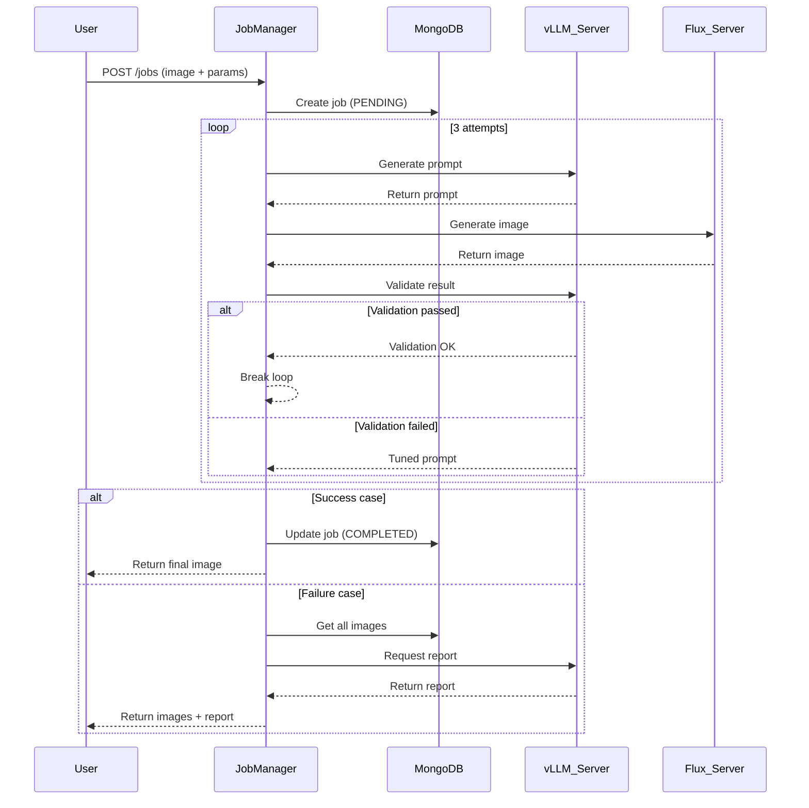

# APEX Portrait Generator - Backend System


## Overview

APEX Portrait Generator is an advanced AI-powered system that creates professional-quality portraits from reference images and text parameters. This backend system orchestrates a complex workflow between vision-language models and image generation models to produce high-fidelity, customizable portraits.

## System Architecture

The backend consists of three interconnected microservices:

1. **Job Manager** - Orchestrates the entire workflow
2. **vLLM Server** - Handles vision-language tasks (prompt generation and validation)
3. **Flux Server** - Generates images using diffusion models



## Key Features

- **Automated Workflow Orchestration**: Coordinates complex multi-step generation process
- **Intelligent Prompt Engineering**: Dynamically crafts prompts based on input parameters
- **Quality Validation**: AI-powered validation of generated images
- **Multi-attempt Generation**: Up to 3 attempts with prompt refinement
- **Comprehensive Reporting**: Detailed failure analysis when generation doesn't succeed
- **MongoDB Integration**: Persistent storage of job history and artifacts

## System Requirements

- NVIDIA GPU (16GB+ VRAM recommended)
- Docker (for containerized deployment)
- Python 3.10+
- MongoDB (local or cloud instance)

## Setup Instructions

### 1. Clone Repository
```bash
git clone https://github.com/your-org/apex-portrait-generator.git
cd apex-portrait-generator
```

### 2. Set Up Environment
Create `.env` files for each service with appropriate configurations:

**job_manager/.env**
```env
VLLM_SERVER_URL=http://localhost:12000
FLUX_SERVER_URL=http://localhost:8000
VLLM_API_KEY=your_secure_key
MONGO_URI=mongodb://localhost:27017/
MAX_ATTEMPTS=3
```

**vllm_server/.env**
```env
MODEL=HuggingFaceTB/SmolVLM2-2.2B-Instruct
PORT=12000
API_KEY=your_secure_key
MAX_SEQ_LENGTH=36000
GPU_UTIL=0.6
```

### 3. Install Dependencies
```bash
# For Job Manager
cd job_manager
pip install -r requirements.txt

# For vLLM Server
cd ../vllm_server
pip install -r requirements.txt

# For Flux Server
cd ../flux_server
pip install -r requirements.txt
```

### 4. Start MongoDB
```bash
docker run -d -p 27017:27017 --name apex-mongo mongo:latest
```

### 5. Start Services
Open three terminal windows:

**Terminal 1 - vLLM Server**
```bash
cd vllm_server
./servevlm.sh
```

**Terminal 2 - Flux Server**
```bash
cd flux_server
./run_FluxServe.sh
```

**Terminal 3 - Job Manager**
```bash
cd job_manager
./run_job_manager.sh
```

## API Documentation

### Job Manager Endpoints

| Endpoint | Method | Description |
|----------|--------|-------------|
| `/jobs` | POST | Create new portrait generation job |
| `/jobs/{job_id}` | GET | Get job status and details |
| `/jobs/{job_id}/result` | GET | Get final generated image |
| `/jobs/{job_id}/report` | GET | Get failure analysis report |
| `/health` | GET | System health check |

### Example Request (Create Job)
```bash
curl -X POST "http://localhost:8001/jobs" \
  -F "image_file=@reference.jpg" \
  -F 'parameters={
    "purpose": "professional_linkedin",
    "attire": "business_casual",
    "background": "modern_office",
    "vibe": "confident",
    "lighting": "studio_softbox",
    "resolution": "4k"
  }'
```

### Example Response
```json
{
  "job_id": "a1b2c3d4-e5f6-7890-g1h2-i3j4k5l6m7n8",
  "status": "pending",
  "message": "Job created and processing started"
}
```

## Configuration Options

### Job Manager
| Environment Variable | Default | Description |
|----------------------|---------|-------------|
| `VLLM_SERVER_URL` | `http://localhost:12000` | vLLM server URL |
| `FLUX_SERVER_URL` | `http://localhost:8000` | Flux server URL |
| `VLLM_API_KEY` | `your_api_key` | vLLM API key |
| `MONGO_URI` | `mongodb://localhost:27017/` | MongoDB connection string |
| `MAX_ATTEMPTS` | `3` | Maximum generation attempts |

### vLLM Server
| Environment Variable | Default | Description |
|----------------------|---------|-------------|
| `MODEL` | `HuggingFaceTB/SmolVLM2-2.2B-Instruct` | Vision-language model |
| `PORT` | `12000` | Service port |
| `API_KEY` | `your_api_key` | API access key |
| `MAX_SEQ_LENGTH` | `36000` | Maximum sequence length |
| `GPU_UTIL` | `0.6` | GPU memory utilization |

## Deployment Options

### Docker Compose
```yaml
version: '3.8'

services:
  job_manager:
    build: ./job_manager
    ports:
      - "8001:8001"
    environment:
      - VLLM_SERVER_URL=http://vllm_server:12000
      - FLUX_SERVER_URL=http://flux_server:8000
      - VLLM_API_KEY=secure_key
      - MONGO_URI=mongodb://mongo:27017/
    depends_on:
      - mongo
      - vllm_server
      - flux_server

  vllm_server:
    build: ./vllm_server
    ports:
      - "12000:12000"
    environment:
      - MODEL=HuggingFaceTB/SmolVLM2-2.2B-Instruct
      - API_KEY=secure_key
    deploy:
      resources:
        reservations:
          devices:
            - driver: nvidia
              count: 1
              capabilities: [gpu]

  flux_server:
    build: ./flux_server
    ports:
      - "8000:8000"
    deploy:
      resources:
        reservations:
          devices:
            - driver: nvidia
              count: 1
              capabilities: [gpu]

  mongo:
    image: mongo:latest
    ports:
      - "27017:27017"
    volumes:
      - mongo_data:/data/db

volumes:
  mongo_data:
```

### Kubernetes Deployment
```yaml
apiVersion: apps/v1
kind: Deployment
metadata:
  name: apex-backend
spec:
  replicas: 1
  selector:
    matchLabels:
      app: apex-backend
  template:
    metadata:
      labels:
        app: apex-backend
    spec:
      containers:
      - name: job-manager
        image: your-registry/job-manager:latest
        ports:
        - containerPort: 8001
        envFrom:
        - configMapRef:
            name: apex-config

      - name: vllm-server
        image: your-registry/vllm-server:latest
        ports:
        - containerPort: 12000
        resources:
          limits:
            nvidia.com/gpu: 1

      - name: flux-server
        image: your-registry/flux-server:latest
        ports:
        - containerPort: 8000
        resources:
          limits:
            nvidia.com/gpu: 1

      - name: mongo
        image: mongo:latest
        ports:
        - containerPort: 27017
        volumeMounts:
        - name: mongo-persistent-storage
          mountPath: /data/db

      volumes:
      - name: mongo-persistent-storage
        persistentVolumeClaim:
          claimName: mongo-pv-claim
```

## Performance Metrics

| Component | Average Response Time | GPU Memory | Throughput |
|-----------|------------------------|------------|------------|
| vLLM Server | 2.8s | 12GB | 4 req/s |
| Flux Server | 8.5s | 14GB | 2 req/s |
| Job Manager | 15-45s | N/A | 3 req/s |

## Troubleshooting

**Common Issues:**
- CUDA out of memory: Reduce image dimensions or decrease GPU utilization
- Model loading failures: Check internet connection and model accessibility
- Validation failures: Adjust parameters or increase MAX_ATTEMPTS

**Log Locations:**
- Job Manager: `job_manager/jobs.log`
- vLLM Server: `vllm_server/vllm.log`
- Flux Server: `flux_server/flux.log`

## Contributing

We welcome contributions! Please follow these steps:
1. Fork the repository
2. Create a feature branch (`git checkout -b feature/your-feature`)
3. Commit your changes (`git commit -am 'Add some feature'`)
4. Push to the branch (`git push origin feature/your-feature`)
5. Create a new Pull Request

## License

This project is licensed under the APACHE 2.0 License - see the [LICENSE.md](LICENSE.md) file for details.

---

**APEX Portrait Generator** - Revolutionizing digital portraiture through AI innovation.  
Made with ❤️ for photographers and digital artists worldwide.